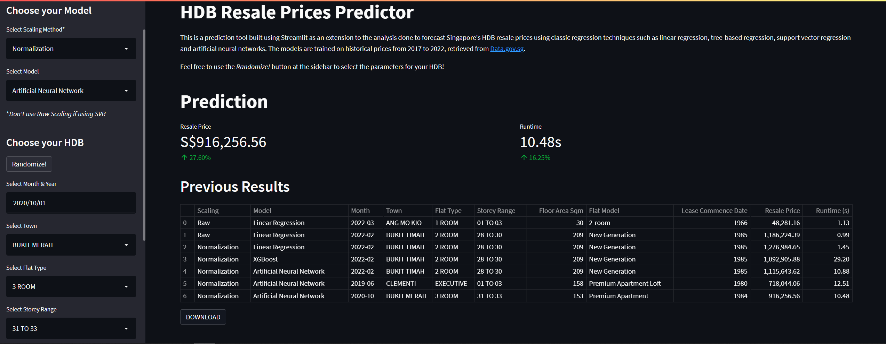

# HDB Resale Prices Predictor

[View HDB Resale Predictor Here](https://share.streamlit.io/zhermin/hdb-resale-predictor/ "HDB Resale Price Predictor Tool")

This is a prediction tool built using Streamlit as an extension to the analysis we have done to forecast Singapore's HDB resale prices using classic regression techniques such as linear regression, tree-based regression, support vector regression and artificial neural networks. The models are trained on historical prices from 2017 to 2022, retrieved from [Data.gov.sg](https://data.gov.sg/dataset/resale-flat-prices "Historical Resale Flat Prices"). 

Users can easily select the scaling method and model choice as well as input their own HDB parameters or click *Randomize!* to get a random set of parameters, all from the sidebar. Prediction results will then be shown in the middle along with a downloadable record of their previous inputs. Users may also view or download the raw dataset used to train the models at the bottom of the page. 

## Screenshot of Tool Demo

## Team Members
1. Tam Zher Min
2. Sun Yiming
3. Darren Lim
4. Kenjun Ling